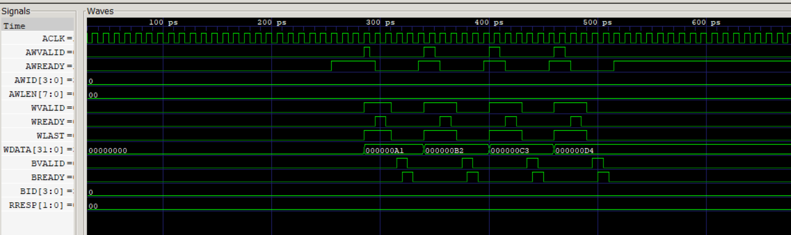
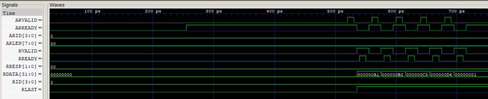

# AXI4 Burst Protocol Controller & Verification Environment

A fully compliant **AXI4 burst write and read controller** with a **UVM-style C++ verification environment** built on Verilator. The project implements an AXI4 slave with FIFO integration, internal memory, burst tracking (INCR/FIXED/WRAP), WLAST/RLAST protocol error detection, and a layered testbench with driver, monitor, and functional coverage.

Built from scratch — RTL design, testbench architecture, and protocol debug infrastructure.

---

## Architecture

```
┌─────────────────────────────────────────────────────────────────┐
│                        AXI4 Slave DUT                           │
│                                                                 │
│  ┌──────────────┐   ┌──────────────────┐   ┌────────────────┐  │
│  │ Write Burst  │   │  Internal Memory │   │  Read Burst    │  │
│  │ FSM          │──▶│  (256 x 32-bit)  │◀──│  FSM           │  │
│  │              │   │                  │   │                │  │
│  │ AW→W→B      │   │  Shared R/W      │   │ AR→R (burst)   │  │
│  │ WLAST check │   │                  │   │ RLAST gen      │  │
│  │ BRESP gen   │   └──────────────────┘   │ Backpressure   │  │
│  └──────────────┘            │            └────────────────┘  │
│                      ┌───────▼───────┐                        │
│                      │   FIFO (8×16) │                        │
│                      │   Status Regs │                        │
│                      └───────────────┘                        │
└─────────────────────────────────────────────────────────────────┘
                              │
┌─────────────────────────────▼───────────────────────────────────┐
│                   C++ Verification Environment                  │
│                                                                 │
│  ┌──────────┐   ┌──────────┐   ┌──────────┐   ┌────────────┐  │
│  │ Driver   │   │ Monitor  │   │ Coverage │   │ Sequences  │  │
│  │          │   │          │   │ Tracker  │   │            │  │
│  │ Write()  │   │ AW latch │   │ Addr bins│   │ 10 tests:  │  │
│  │ Read()   │   │ W beats  │   │ Data bins│   │ FIFO       │  │
│  │ Burst    │   │ B resp   │   │ Burst    │   │ INCR/FIXED │  │
│  │  Write() │   │ AR latch │   │  length  │   │ WRAP       │  │
│  │ Burst    │   │ R beats  │   │  type    │   │ WLAST err  │  │
│  │  Read()  │   │ RLAST    │   │ WLAST    │   │ Multi-ID   │  │
│  │ BadWLAST │   │ RID      │   │ Per-ID   │   │ Edge cases │  │
│  └──────────┘   └──────────┘   └──────────┘   └────────────┘  │
└─────────────────────────────────────────────────────────────────┘
```

## Key Features

**RTL Design (SystemVerilog)**
- Full AXI4 write burst: AW→W→B channel with AWLEN/AWSIZE/AWBURST/AWID
- Full AXI4 read burst: AR→R channel with ARLEN/ARSIZE/ARBURST/ARID/RID/RLAST
- INCR, FIXED, and WRAP burst types on both channels
- Byte-strobe write support (WSTRB)
- WLAST protocol error detection with BRESP=SLVERR response
- Unified RLAST generation from single canonical condition
- Registered read data pipeline (no combinational ARADDR→RDATA path)
- Strict AXI4 backpressure compliance (VALID/READY handshake rules)
- FIFO region isolation (addresses < 0x100 forced to single-beat)
- Internal 256-word memory shared between read and write paths
- 8-entry × 8-bit FIFO with status registers

**Verification Environment (C++/Verilator)**
- Layered testbench: Driver → Monitor → Coverage → Sequences
- Cycle-accurate AXI4 handshake timing with `prev_wready`/`prev_bvalid`/`prev_rvalid` tracking
- Protocol-aware monitor: validates WLAST, RLAST, RID, BRESP on every beat
- Functional coverage: address bins, data patterns, burst length/type, WLAST correctness, per-ID tracking
- 10 directed test sequences covering all burst types and protocol error injection
- VCD waveform generation for GTKWave debug

**Bug Injection (for WaveEye RCA integration)**
- `BUG_RD_COUNTER_INIT` — off-by-one read beat counter
- `BUG_RLAST_EARLY` — RLAST asserted one beat too soon
- `BUG_RD_ADDR_NO_HSHK` — address advances without RREADY handshake

---

## Waveform Verification

### Write Burst — 4-beat INCR with WLAST 



**What to verify:** AWVALID/AWREADY handshake with AWLEN=3, followed by 4 W beats where WLAST rises only on beat 3. BVALID/BREADY completes with BRESP=OKAY.

### Read Burst — 4-beat INCR with RLAST 



**What to verify:** ARVALID/ARREADY handshake with ARLEN=3, then 4 R beats with RDATA incrementing (`CAFE0001→0004`). RLAST=0 on beats 0–2, RLAST=1 on beat 3. RID=1 constant across all beats.

---

## Test Results

All 10 tests pass with zero monitor protocol violations:

| Test | Description | Signals Verified | Result |
|------|-------------|-----------------|--------|
| 1 | Single-beat FIFO write/read | FIFO data integrity, status regs | PASS |
| 2 | 4-beat INCR write + single-beat read-back | Memory write, address increment | PASS |
| 3 | 4-beat INCR burst read | RDATA, RLAST, RID, burst addressing | PASS |
| 4 | 8-beat INCR write + read | Longer burst, all 8 beats verified | PASS |
| 5 | 3-beat FIXED write + read | Same address all beats, last-write-wins | PASS |
| 6 | 4-beat WRAP write + read | Wrap boundary at 0x308, correct wrap | PASS |
| 7 | Single-beat burst read (ARLEN=0) | Edge case, RLAST=1 on only beat | PASS |
| 8 | WLAST early error injection | SLVERR response, burst termination | PASS |
| 9 | WLAST missing error injection | SLVERR response, protocol flag | PASS |
| 10 | Multi-ID burst writes + reads | IDs 0–3, RID/BID match, data integrity | PASS |

**Coverage Report:**
```
Reads:  37 | Writes: 39
Burst:  Single=5, Short=9, Medium=1
Types:  INCR=13, FIXED=1, WRAP=1
WLAST:  Correct=13, Early=1(injected), Missing=1(injected)
BRESP:  OKAY=13, SLVERR=2(injected)
IDs:    0–7 all exercised
```

---

## Project Structure

```
├── Makefile                          Build system (Verilator + MSYS2/MinGW)
├── rtl/
│   ├── axi4_burst_fifo_wrapper.sv   AXI4 burst controller (write + read FSMs)
│   ├── dut_axi4.v                   Top-level DUT wrapper
│   └── fifo.sv                      Parameterized synchronous FIFO
├── sim/
│   ├── tb_top.cpp                   Simulation entry point, reset, clock
│   ├── driver.cpp                   AXI4 transaction driver (write/read/burst)
│   ├── monitor.cpp                  Protocol monitor (WLAST/RLAST/RID checker)
│   ├── coverage_tracker.cpp         Functional coverage collector
│   └── sequence.cpp                 10 directed test sequences
├── include/
│   ├── driver.h
│   ├── monitor.h
│   ├── coverage_tracker.h
│   ├── globals.h
│   └── sim_utils.h
└── docs/
    ├── write_burst_waveform.png     GTKWave screenshot: write burst
    ├── read_burst_waveform.png      GTKWave screenshot: read burst
    └── wlast_error_waveform.png     GTKWave screenshot: protocol error
```

---

## Build & Run

**Prerequisites:** Verilator 5.x, g++ with C++17, GTKWave (optional)

```bash
# On MSYS2/MinGW (Windows)
pacman -S mingw-w64-x86_64-verilator mingw-w64-x86_64-gtkwave

# Build
make clean && make all

# Run simulation
make run

# View waveforms
make wave
```

**Expected output:**
```
[INFO] Applying reset...
[INFO] Reset released.
[INFO] Running AXI4 burst test sequence...

TEST 1: Single-beat FIFO writes & reads          ✓
TEST 2: INCR burst write + single-beat reads      ✓
TEST 3: INCR burst READ (4 beats)                 ✓
TEST 4: 8-beat write + 8-beat burst read           ✓
TEST 5: FIXED burst write + read                   ✓
TEST 6: WRAP burst write + read                    ✓
TEST 7: Single-beat burst read (ARLEN=0)           ✓
TEST 8: WLAST early error → SLVERR                ✓
TEST 9: WLAST missing error → SLVERR              ✓
TEST 10: Multi-ID burst writes + reads             ✓
```

---

## AXI4 Protocol Rules Implemented

| Rule | Spec Section | Implementation |
|------|-------------|----------------|
| AWVALID must hold until AWREADY | A3.2.1 | Write FSM: latches on handshake only |
| WLAST on final beat only | A3.4.1 | beat_counter == burst_len check |
| WLAST early/missing → SLVERR | A3.4.1 | wlast_error flag → BRESP=SLVERR |
| ARREADY only in IDLE | A3.2.1 | Read FSM: ARREADY=0 during R_BURST |
| RVALID must hold until RREADY | A3.2.1 | RVALID unconditional in R_BURST |
| RLAST on final beat only | A3.4.4 | read_is_final_beat canonical wire |
| RID constant across burst | A5.3.1 | RID driven from latched read_id |
| No state change without handshake | A3.2.1 | Counter/addr gated by RVALID && RREADY |
| Backpressure: hold all signals | A3.2.1 | Else branch: no updates when RREADY=0 |
| FIFO region: single-beat only | Design choice | ar_is_fifo_region clamps read_len=0 |

---

## GTKWave Signal Groups

To quickly verify correctness, add these signal groups in GTKWave:

**Write Channel:**
```
TOP.ACLK  TOP.ARESETn
TOP.AWVALID  TOP.AWREADY  TOP.AWADDR  TOP.AWLEN  TOP.AWID  TOP.AWBURST
TOP.WVALID  TOP.WREADY  TOP.WDATA  TOP.WLAST  TOP.WSTRB
TOP.BVALID  TOP.BREADY  TOP.BID  TOP.BRESP
```

**Read Channel:**
```
TOP.ACLK
TOP.ARVALID  TOP.ARREADY  TOP.ARADDR  TOP.ARLEN  TOP.ARID  TOP.ARBURST
TOP.RVALID  TOP.RREADY  TOP.RDATA  TOP.RLAST  TOP.RID  TOP.RRESP
```

---

## Design Decisions

**Why registered read data pipeline?**
The read FSM stages `rdata_next` in one cycle, then transfers to `RDATA` in the next. This avoids a combinational path from ARADDR through `mem_read()` to the output — critical for timing closure with synchronous memories and for future integration with real SRAM macros.

**Why separate FIFO and memory regions?**
Addresses below 0x100 (FIFO data, status, level) are peripheral registers that don't support burst semantics. Allowing a burst starting at 0x10 would pop one FIFO entry then read from memory on subsequent beats — a subtle protocol violation. The `ar_is_fifo_region` check forces `read_len=0` for these addresses.

**Why prev_wready / prev_bvalid / prev_rvalid in the monitor?**
RTL uses non-blocking assignments. On a posedge, `if (WVALID && WREADY)` reads the OLD (pre-edge) value of WREADY. After eval, the NEW value is visible. The monitor must use `prev_wready` (captured after the previous eval) to match the RTL's actual handshake detection — otherwise it reports false protocol violations.

---

## Related: WaveEye RCA Integration

This project includes optional **bug injection parameters** for integration with [WaveEye](waveeye/), an automated root-cause analysis tool that parses VCD waveforms and diagnoses AXI4 protocol violations.

To enable bugs for WaveEye testing, modify `dut_axi4.v`:
```verilog
.BUG_RD_COUNTER_INIT (1),   // off-by-one → premature RLAST
.BUG_RLAST_EARLY     (1),   // RLAST fires one beat early
.BUG_RD_ADDR_NO_HSHK (1)    // address advances without handshake
```

---

## Tools & Versions

- **Verilator** 5.x (tested with 5.024 on MSYS2 and 5.020 on Ubuntu)
- **g++** 13.x with C++17
- **GTKWave** 3.3.x for waveform viewing
- **Platform** Windows 11 (MSYS2/MinGW64) and Linux (Ubuntu 24)

---

## License

MIT
